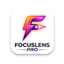

# 🔍 FocusLens Pro

**FocusLens Pro**, ADHD (DEHB) dostu, dikkat dağınıklığını önleyen ve okuma deneyimini kişiselleştiren güçlü bir web tarayıcı eklentisidir. Web sayfalarını temizler, sadece içeriğe odaklanmanızı sağlar ve gelişmiş çeviri araçlarıyla yabancı dil engelini ortadan kaldırır.

---

## ✨ Özellikler

### 🎯 Odaklanma Modu (Focus Mode)
- **Görsel Temizlik**: Reklamları, yan çubukları ve dikkat dağıtan tüm öğeleri tek tuşla gizler.
- **Canlı Düzenleyici**: Başlıklar (H1, H2, H3) ve paragraflar için yazı boyutu, satır aralığı ve renk ayarlarını anlık olarak değiştirin.
- **Kişiselleştirilmiş Genişlik**: Okuma alanının genişliğini göz konforunuza göre ayarlayın.
- **Premium Estetik**: Cam morfolojisi (glassmorphism) ve modern koyu mod desteği.

### 🌍 Akıllı Çeviri Sistemi
- **Bağımsız Mod**: Odaklanma modu kapalıyken bile sadece çeviri özelliğini kullanabilme.
- **Sağ Tıkla Çeviri**: Kelime veya cümleleri seçip sağ tıklayarak anında Google Translate destekli sonuçlar alın.
- **Örnek Cümleler**: Çevirilen kelimenin geçtiği cümleyi ve o cümlenin tam çevirisini görüntüleyerek bağlamı anlayın.
- **Sözlük Desteği**: Kelimelerin türlerini (isim, fiil vb.) ve farklı anlamlarını keşfedin.

---

## 🚀 Kurulum (Geliştirici Modu)

Henüz Chrome Web Store'da yayınlanmadıysa, şu adımları izleyerek manuel olarak kurabilirsiniz:

1. Bu depoyu indirin veya klonlayın.
2. Chrome tarayıcınızda `chrome://extensions/` adresine gidin.
3. Sağ üst köşedeki **"Geliştirici Modu"**nu (Developer Mode) aktif hale getirin.
4. **"Paketlenmemiş öğe yükle"** (Load unpacked) butonuna tıklayın.
5. Bu projenin bulunduğu klasörü seçin.

---

## 🛠️ Teknik Altyapı

- **Manifest V3**: Modern Chrome standartlarıyla tam uyumlu.
- **Vanilla JS & CSS**: Maksimum performans ve düşük kaynak tüketimi.
- **MyMemory API / Google Translate Proxy**: Hızlı ve doğru çeviri sonuçları.
- **Storage Sync**: Ayarlarınızı tarayıcı seansları arasında korur.

---

## 📜 Lisans

Bu proje MIT Lisansı ile lisanslanmıştır. Daha fazla bilgi için [LICENSE](LICENSE) dosyasına göz atabilirsiniz.

---

## 🤝 İletişim & Katkıda Bulunma

Hata raporları veya özellik önerileri için lütfen bir **Issue** oluşturun veya **Pull Request** gönderin. Geliştirmelere her zaman açığız!

---
*Geliştirildi: [Talha](https://github.com/sizin-github-kullanici-adiniz)*
